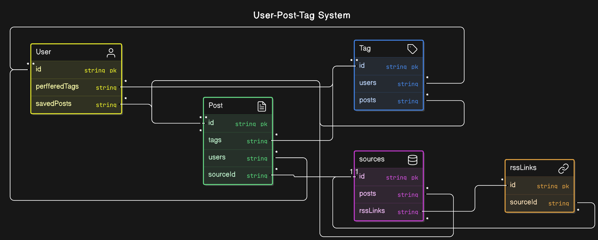

# This is the Scrapper for FinBrief

## chore
- Add deployment instructions

## Run Locally(Always Follow)

Clone the project

```bash
  git clone https://github.com/FinBrief/Scrapper.git
```

Go to the project directory

```bash
  cd scrapper
```

Fill the .env file(very important):

```bash
  Refer to .env.example 
```


To get Started locally first:

```bash
  npm run build
```

  
Start the server

```bash
  npm run start
```

## In-Memory Variables
```bash
  // In-memory queues instead of redis
  export const feedQueue : Array<itemType> = [];
  export const taskQueue : Array<tasktype> = [];

  // In-memory variables for sources, rssLinks, contentLocationMap and latestTimeMap
  export const sources : Array<string> = [];
  export const rssLink : Map<string,Array<string>> = new Map<string,Array<string>>();
  export const contentLocationMap : Map<string,string> = new Map<string,string>(); 
  export const latestTimeMap : Map<string,bigint> = new Map<string,bigint>();
```

## schema


 
